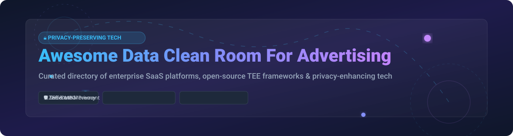

# Awesome Data Clean Room For Advertising 🔒📊

  
  
  
  
  

> **A curated directory of Privacy-Preserving Data Collaboration Platforms, Open-Source TEE Enclaves, Differential Privacy Frameworks, and Advertising Data Clean Rooms.**

Welcome to the ultimate resource guide for **Data Clean Rooms (DCR)**, **Privacy-Enhancing Technologies (PETs)**, **Trusted Execution Environments (TEEs)**, and **Multi-Party Data Collaboration** in digital advertising and adtech. These technologies enable brands, publishers, and platforms to perform joint audience overlap analysis, attribution modeling, and lookalike targeting without exposing raw PII or user data.

---

## 📚 Table of Contents
- [🌐 SaaS / Hosted Data Clean Room Platforms](#-saas--hosted-data-clean-room-platforms)
- [🔓 Open-Source GitHub Projects & PET Frameworks](#-open-source-github-projects--pet-frameworks)
- [🤝 How to Contribute](#-how-to-contribute)
- [💖 Support & Sponsorship](#-support--sponsorship)
- [📈 Star History](#-star-history)
- [⚠️ Disclaimer](#%EF%B8%8F-disclaimer)

---

## 🌐 SaaS / Hosted Data Clean Room Platforms

> 💡 **Market Size & Structure**: The global Data Clean Room market is valued at **~$2.15 Billion** and projected to reach **~$4.71 Billion by 2030** (CAGR of **~17.0%**). The market is **moderately fragmented**: while cloud giants (AWS, Snowflake, Google) and major walled gardens dominate execution layers, independent platforms (LiveRamp, InfoSum, Optable, Decentriq) serve non-relational, multi-party, and privacy-first collaboration niches.

### 🏢 SaaS Product Comparison & Financial Metrics

| Platform / Vendor | Starting Tier Pricing | Free Tier / Trial Limits | Company Size / Revenue / Valuation | Description |
| :--- | :--- | :--- | :--- | :--- |
| **[Salesforce Data Cloud](https://help.salesforce.com/)** | $108,000 / year (Standard Edition baseline) | **30-Day Developer Org Trial** (includes limited Data Cloud credit sandbox) | **$226.5B Market Cap** (~$41.5B FY26 Revenue) | Clean room within Salesforce Data 360 with zero-copy data sharing between orgs, permissioned query templates, and DMO reporting. |
| **[Snowflake Data Clean Rooms](https://www.snowflake.com/)** | $2.00 – $4.00 per Snowflake Credit (Standard compute) | **30-Day Free Trial** ($400 in free compute credits) | **$55.0B Market Cap** (~$3.4B FY26 Revenue) | Native clean rooms within Snowflake Data Cloud supporting symmetric multiparty collaboration, Cortex AI code generation, and zero-copy queries. |
| **[AWS Clean Rooms](https://aws.amazon.com/clean-rooms/)** | $1.15 per CRPU-hour (Clean Rooms Processing Unit, per-second billing) | **12-Month AWS Free Tier** ($300 AWS credits for new accounts) | **$2.20T Amazon Market Cap** (~$620B AWS Parent Revenue) | Fully managed AWS collaboration service supporting SQL, PySpark, AWS Clean Rooms ML lookalike modeling, and differential privacy controls. |
| **[Google Ads Data Hub](https://developers.google.com/ads-data-hub)** | Billed via BigQuery ($6.25 per TB scanned or slot-hour rates) | **$300 Free Trial Credits** (via Google Cloud Platform free tier) | **$2.10T Alphabet Market Cap** (~$350B Parent Revenue) | Privacy-safe data warehouse on BigQuery for analyzing Google Ads & YouTube campaign data with strict aggregation thresholds (10–50 users). |
| **[Datavant](https://www.datavant.com/)** | Custom enterprise licensing (starts ~$50,000 / year) | **Guided Sandbox Demo** (no self-serve free plan, custom evaluation setup) | **$7.0B Valuation** (~$1.5B Annual Revenue) | Healthcare and life sciences data collaboration platform powered by AWS Clean Rooms for zero-movement privacy-first patient data linking. |
| **[LiveRamp Safe Haven / Habu](https://liveramp.com/)** | Custom enterprise pricing (starts ~$30,000 / year) | **14-Day Guided Proof of Concept** (sales-managed trial environment) | **$2.29B Market Cap** (~$813M FY26 Revenue) | Neutral connectivity infrastructure and Azure Confidential Computing (ACC) hardware TEE clean room with RampID & HEM exact joins. |
| **[InfoSum](https://www.infosum.com/)** | Custom annual platform licensing (starts ~$25,000 / year) | **Guided Interactive Sandbox** (sales-assisted trial environment) | **~$350M Valuation** (~$15M Estimated ARR) | True multi-party DCR using non-movement Private Set Intersection (PSI), Platform Sigma cloud vaults, and full SQL compatibility. |
| **[Optable](https://www.optable.co/)** | Custom publisher tier (starts ~$12,000 / year) | **Interactive Demo Trial** (14-day sales-assisted sandbox access) | **~$44M Total Funding** (~$13.3M Estimated ARR) | Data collaboration network with Insights Clean Rooms for differential privacy audience overlap analysis and privacy budget management. |
| **[Decentriq](https://www.decentriq.com/)** | Custom value-based commercial model (starts ~$10,000 / year) | **Interactive Demo Sandbox** (30-day guided evaluation environment) | **~$75M Valuation** (~$3.2M Estimated ARR) | Swiss data clean room leveraging hardware Confidential Computing (TEEs) for privacy-preserving data collaboration across Europe with NIQ data. |

---

## 🔓 Open-Source GitHub Projects & PET Frameworks

> 🌟 **Open-Source Landscape**: Open-source solutions provide essential building blocks like **Trusted Execution Environments (TEEs)**, **Private Set Intersection (PSI)**, and **Differential Privacy (DP)** libraries to construct custom, audit-verifiable data clean rooms.

### 📦 Top Open-Source Repositories (Sorted by Stars_Count)

| Project / Repository | Stars_Count | Primary Focus & Architecture | Description |
| :--- | :--- | :--- | :--- |
| **[OpenMined / PySyft](https://github.com/OpenMined/PySyft)** |  | Differential Privacy & Federated Learning Framework | Python library for private, secure data science. Enables federated learning, differential privacy, and encrypted computation across remote data silos. |
| **[Google / Fully Homomorphic Encryption](https://github.com/google/fully-homomorphic-encryption)** |  | Homomorphic Encryption C++ / Rust Libraries | Google's open-source FHE libraries and compilers for performing arbitrary operations on encrypted data without decrypting it. |
| **[Open Enclave SDK](https://github.com/openenclave/openenclave)** |  | Hardware TEE Enclave SDK (Intel SGX & ARM TrustZone) | SDK for building C/C++ enclave applications targeting hardware-enforced Trusted Execution Environments across multiple hardware architectures. |
| **[OpenDP / OpenDP Library](https://github.com/opendp/opendp)** |  | Differential Privacy Algorithms (Rust & Python) | Community-generated suite of statistical differential privacy algorithms produced by the Harvard OpenDP project for secure data release. |
| **[PrivacyGo Data Clean Room](https://github.com/tiktok-privacy-innovation/PrivacyGo-DataCleanRoom)** |  | TEE-based Advertising Data Clean Room (ManaTEE) | TikTok's open-source TEE advertising clean room (Confidential Computing Consortium project **ManaTEE**). Uses a two-stage Jupyter programming + TEE secure execution pipeline. |

---

## 🤝 How to Contribute

Contributions are warmly welcomed! Please follow these simple steps to add or update an entry:

1. **Fork** this repository 🍴
2. Create a feature branch (`git checkout -b add-new-dcr-tool`)
3. Edit `README.md` following the table formats above
4. Submit a **Pull Request** 🚀 with a brief explanation of the tool

---

## 💖 Support & Sponsorship

If you find this repository useful for your adtech, privacy engineering, or data collaboration research, please consider supporting the project!

- ⭐ **Star this repository** to help others discover it
- 🔀 **Fork & Share** with your team and colleagues
- ☕ **Buy me a coffee**: Sponsor this project via [GitHub Sponsors](https://github.com/sponsors/ishandutta2007)

Thank you for your support! 🚀

---

## 📈 Star History

---

## ⚠️ Disclaimer

- This repository is a community-curated list and does not constitute official endorsement.
- All SaaS logos, trademarks, and brand names belong to their respective owners.
- Ensure compliance with global privacy regulations (GDPR, CCPA, CPRA) when evaluating or deploying data clean room platforms.
